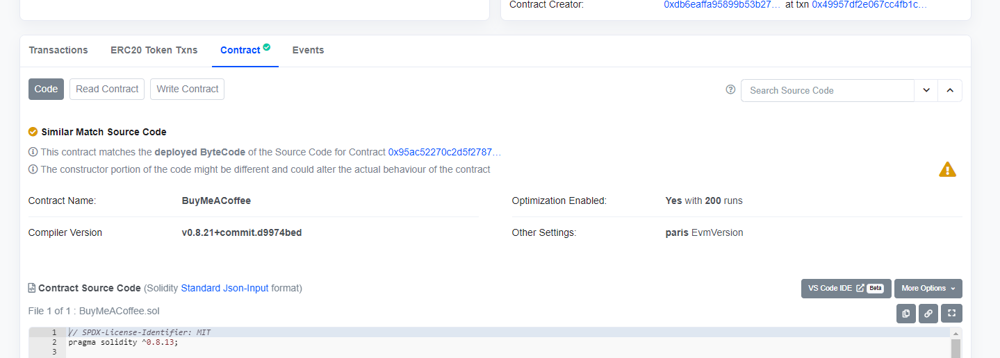

# Contents

- [Project Layout](#project-layout)
- [Usage](#usage)
- [Deploying your own contract](#deploying-your-own-contract)
- [Deploying to local node](#deploy-to-local-node)
- [Contributing](#contributing)

### Project Layout

```
.
├── foundry.toml
├── script
│   └── CoffeeShopFactory.s.sol
├── src
│   └── CoffeeShopFactory.sol
│   └── CoffeeShop.sol
│   └── Errors.sol
│   └── Clones.sol
└── test
    └── CoffeeShop.t.sol
    └── CoffeeShopFactory.t.sol

```

### Install dependencies

```shell
forge install
```

### Build

```shell
forge build
```

### Test

```shell
forge test
```

### Coverage

You will need to install [genhtml](https://github.com/linux-test-project/lcov) to generate html reports (`brew install lcov` for osx).

```shell
forge coverage --report lcov && genhtml -o report --branch-coverage lcov.info
```

### Format

```shell
forge fmt
```

### Deploy and verify contracts on Base Mainnet

Open `.env` file.

`PRIVATE_KEY` is your private wallet key. Make sure to prefix it by "0x" to convert to a hex string.


```bash
source .env

f```

<b>Note: The above command will print the address of your contract and a link to the block explorer. Click on the block explorer link to verify whether your contract has been deployed or not </b>




Forge runs your solidity script. In that script it tries to broadcast the transaction. It writes it back into the broadcast folder in a `run-latest.json` file.

### ABI

To extract the `abi` of your contract, you can go to `out/CoffeeShop.sol/CoffeeShop.json` and copy the value corresponding to the `abi` key

## Deploy to local node

Initially, building on a local node can offer numerous benefits, including:

- The ability to add debug statements.
- The capability to fork a chain at a particular block, enabling the detection of reasons behind specific behaviors.
- The absence of the need for testnet/mainnet funds.
- Faster testing, as only your node is responsible for consensus.

You can deploy your contracts to local node for faster testing as follows:

```bash
make local-node
```


To deploy the contract:

- Make sure to delete the following lines from `foundry.toml` because locally we dont have a block explorer

  ```
  [etherscan]
  "${NETWORK}"={key="${BLOCK_EXPLORER_API_KEY}"}
  ```

- Create a `.env` file using the `.env.example` file provided in your contracts folder and add one the private keys printed on your terminal when you ran `make local-node`. Also update the `RPC_URL` to `http://127.0.0.1:8545`, this will make sure your contracts are deployed locally

- Deploy the sample contract using:
  ```
  source .env
  forge script script/LocalContract.s.sol:LocalContractScript  --broadcast --rpc-url ${RPC_URL}
  ```


You can observe that the console2 library facilitates the addition of console logs in the contract, which would not have been possible if you were deploying to a testnet or mainnet.
